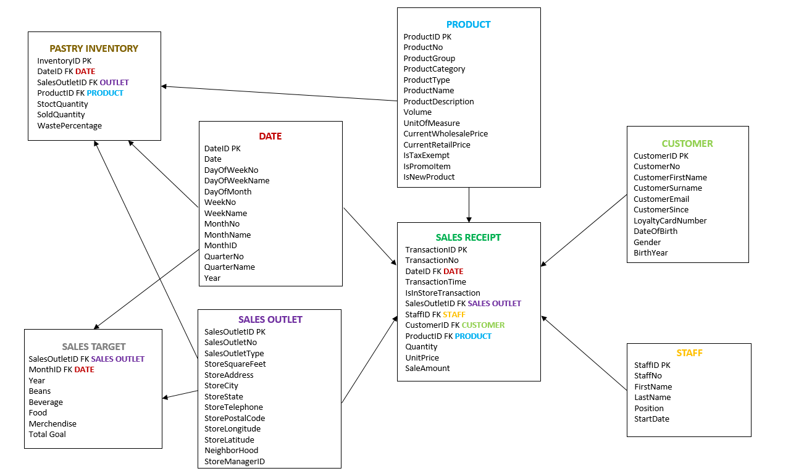
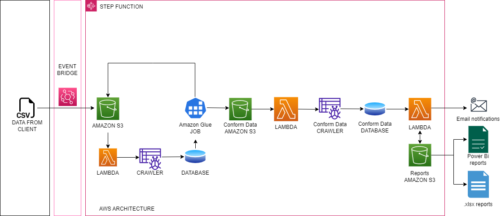

# coffee-shop-aws-data-academy

Data analysis pipeline on a fictional coffee chain retail data.

## Data 

The data was organized into three .csv files: Sales Reciept, Pastry Inventory and Sales Target.

### DataBase Schema

The data was modeled with the following approach:

***
## Architecture
The data pipeline was created with the use of Amazon Web Services. 

### Amazon EventBridge 
Executes the start of the pipeline
* on schedule - once every day / week / month
* on files being uploaded to Amazon S3 bucket
### [Step Functions](./step_functions/states.asl.json)
Defines the steps to be followed during execution of the pipeline.

### Amazon S3
Holds all files in .csv, .parquet and .xlsx formats. The following buckets have been defined:
* raw data - original files
* clean data - partitioned by date files
* conform data - tables created according to DataBase Schema
* reports - .xlsx reports

### Amazon Glue Services
#### Crawlers
Map data from S3 buckets to Databases to be transformed further.
#### Databases
Hold all mapped tables.
#### [Jobs](./glue_jobs/)
Perform transformations on data
* partition data
* create tables
* create relations between tables

### Amazon Athena
Executes SQL queries on data tables. 

[Queries for following topics have been created:](./sql_queries/)
* customer report
* employee report
* sales report

### [Amazon Lambda](./lambda_functions/)
Runs scripts in a serverless mode to perform simple tasks.
* check s3 files - checks whether all necessary files have been uploaded to S3 bucket
* start crawler - invokes execution of a crawler
* check crawler status - checks whether crawler run has finished
* [create report](./lambda_functions/reports/) - creates an .xlsx report using SQL queries
* send mail - sends a notification that the process is finished

***
## [Results Visualisation](./lambda_functions/reports/)
Visualisation of reports was done using Power BI tool.
